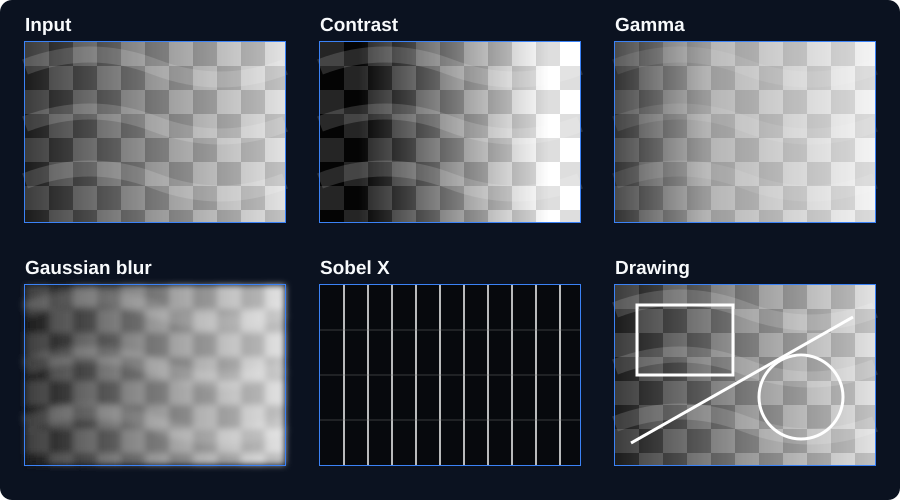

# C++ Image Processing Library

[](https://github.com/neamturazvan/cpp-image-processing/actions/workflows/ci.yml)


A dependency-free C++17 library for manipulating 8-bit grayscale images. It implements
image storage, PGM file I/O, point operations, convolution filters, region-of-interest
extraction and basic drawing primitives from first principles.



## What it demonstrates

- Manual heap-managed pixel storage with deep-copy and move semantics
- Saturating image arithmetic and bounds-checked pixel access
- ASCII (`P2`) and binary (`P5`) PGM reading and writing, including comments
- Region-of-interest extraction using a small geometry API
- A polymorphic processing interface for interchangeable operations
- Brightness/contrast adjustment and gamma correction
- General odd-sized 2D convolution with zero or extended borders
- Mean blur, Gaussian blur and horizontal/vertical Sobel filters
- Bresenham lines, rectangles and midpoint circles with boundary clipping
- A portable CMake build, automated tests and GitHub Actions CI

The project deliberately works without OpenCV or another imaging library so that memory
ownership, file parsing and the filtering algorithms remain visible in the implementation.

## Build and test

You need a C++17 compiler and CMake 3.20 or newer.

```bash
cmake -S . -B build -DCMAKE_BUILD_TYPE=Release
cmake --build build --config Release
ctest --test-dir build --build-config Release --output-on-failure
```

The tests cover ownership semantics, arithmetic, bounds checking, ROI extraction, both PGM
formats, point operations, convolution and drawing.

## Quick example

```cpp
#include "imgproc/Draw.h"
#include "imgproc/Image.h"
#include "imgproc/Processing.h"

int main() {
    imgproc::Image image = imgproc::Image::loadPgm("input.pgm");

    imgproc::GammaCorrection gamma(0.7);
    imgproc::Image corrected = gamma.process(image);

    imgproc::Image blurred =
        imgproc::Convolution::gaussianBlur().process(corrected);

    imgproc::Draw::rectangle(blurred, {20, 15, 100, 60}, 255);
    blurred.savePgm("result.pgm", imgproc::PgmFormat::Binary);
}
```

All processors implement `ImageProcessor`, so callers can select or compose operations through
one interface:

```cpp
std::unique_ptr<imgproc::ImageProcessor> operation =
    std::make_unique<imgproc::BrightnessContrastAdjustment>(1.2, 10.0);

imgproc::Image result = operation->process(image);
```

## Run the demo

The example program creates its own synthetic test image and writes several processed PGM files;
no external image assets are required.

```bash
./build/image_processing_demo demo-output
```

On multi-configuration Windows generators, the executable may be under `build/Release/`.

Generated outputs include contrast adjustment, gamma correction, Gaussian blur, Sobel edges,
drawing primitives and ROI extraction.

## Repository layout

```text
.
├── include/imgproc/    Public library headers
├── src/                Image, processing and drawing implementations
├── examples/           Self-contained demonstration program
├── tests/              Dependency-free test executable
├── docs/images/        README preview assets
└── .github/workflows/  Linux build and test workflow
```

## Current scope

This library focuses on single-channel, 8-bit images and PGM files. Convolution is intentionally
implemented as a straightforward single-threaded CPU operation. Color formats, large-image
optimisation and production codec support are outside the current scope.

## License

Released under the [MIT License](LICENSE).
